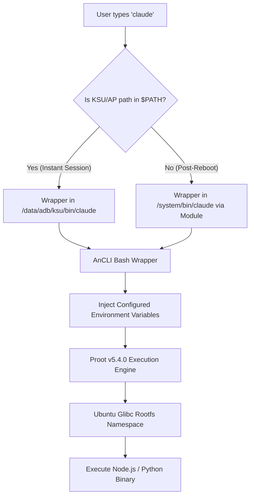

# AnCLI Technical Architecture & Deep Dive

This document outlines the internal design, lifecycle, security model, and configuration flows of **AnCLI (Android CLI) v1.1.0**. It is intended for developers, maintainers, and power users who wish to understand the inner workings of this environment manager.

---

## 1. The Proot + Ubuntu "Fat Base" Mechanism

### 1.1 The Android Bionic Limitation
Android runs on a modified Linux kernel but replaces standard GNU libraries (glibc) with Android's own Bionic C library. This means standard Linux binaries (such as native Go binaries for `opencode`, or complex Python wheels with C-extensions for `aider`) will instantly crash with "missing library" or "executable not found" errors on Android. Compiling every single tool specifically for Android Bionic (the Termux approach) is unsustainable and leads to fragmentation.

### 1.2 The Proot Solution
AnCLI bypasses the Bionic limitation by utilizing `proot` v5.4.0 — a user-space implementation of `chroot`, `mount --bind`, and `binfmt_misc` — to create a fully isolated Debian/Ubuntu environment that natively provides `glibc`.
1. **Bootstrap**: `customize.sh` downloads the official `ubuntu-base-arm64` rootfs tarball (approx. 30MB) from a configurable mirror.
2. **Extraction**: It extracts this pristine root filesystem locally to `/data/local/tmp/ancli/rootfs`.
3. **Mount Mapping**: It uses `proot` to transparently map Android's physical device nodes (`/dev`, `/proc`, `/sys`) into this rootfs. This satisfies APT and Node.js networking and hardware-polling requirements.
4. **Fat Base Construction**: Finally, it calls `apt-get install -y nodejs python3 python3-pip git` *inside* the proot namespace. This creates a 100% complete, uncompromised "Fat Base", eliminating any potential dependency issues for downstream CLI agents.
5. **Idempotency**: The bootstrap is guarded — if `python3` already exists inside the rootfs, APT setup is skipped entirely, making re-installs take seconds instead of minutes.

---

## 2. Module Lifecycle

AnCLI is packaged as a standard **Magisk/KernelSU/APatch systemless module**. This allows it to leverage the root framework's built-in capabilities:

### 2.1 Module ZIP Structure
```
ancli-v1.1.0.zip
├── META-INF/com/google/android/
│   ├── update-binary          # Standard Magisk installer
│   └── updater-script         # #MAGISK marker
├── module.prop                # Metadata + updateJson for OTA
├── customize.sh               # Runs during flash (bootstrap)
├── service.sh                 # Runs after every boot
├── uninstall.sh               # Runs on module removal
├── system/bin/ancli           # Auto-mounted to /system/bin/
└── ancli/
    ├── ancli-core.py          # Bundled package manager
    └── registry.json          # Fallback registry
```

### 2.2 Lifecycle Hooks

| Hook | When | What it does |
| :--- | :--- | :--- |
| **`customize.sh`** | Module is flashed via Manager | Downloads PRoot, Ubuntu rootfs, installs APT deps, deploys core script, injects instant-access wrappers |
| **`service.sh`** | Every boot (`late_start` phase) | Fixes DNS (`resolv.conf`), ensures PRoot and core script have correct permissions |
| **`uninstall.sh`** | Module removed via Manager | Kills PRoot processes, removes rootfs, cleans KSU/AP dynamic wrappers |
| **`system/bin/ancli`** | Boot (overlay mount) | Framework auto-mounts this to `/system/bin/ancli` — no manual wrapper creation needed |
| **`updateJson`** | Manager checks for updates | Points to `update.json` on GitHub — Manager auto-detects new versions |

### 2.3 OTA Update Flow


---

## 3. The Cloud Plugin Registry System

Instead of hardcoding installation paths into a massive bash script, AnCLI outsources the logic to a strict JSON-based cloud registry (`registry.json`).

### 3.1 JSON Schema
```json
{
  "version": "1.0.0",
  "apps": {
    "aider": {
      "name": "Aider",
      "description": "AI pair programming in your terminal",
      "install_cmd": "pip install aider-chat",
      "update_cmd": "pip install --upgrade aider-chat",
      "uninstall_cmd": "pip uninstall -y aider-chat",
      "env_vars": ["ANTHROPIC_API_KEY", "OPENAI_API_KEY"],
      "optional_env_vars": ["OPENAI_API_BASE", "DEEPSEEK_API_KEY", "AIDER_MODEL"],
      "executable": "aider"
    }
  }
}
```

### 3.2 Registry Fetch with Retry
The Python core fetches the registry with a 3-attempt retry mechanism (15-second timeout per attempt, 2-second backoff). If all retries fail, it falls back to the locally cached copy. If no cache exists, it uses the bundled fallback shipped with the module.

### 3.3 Dynamic Configuration Injection & OAuth Fallback
The Python core manager (`ancli-core.py`) dynamically reads `env_vars` (mandatory) and `optional_env_vars`.
- **API Proxies & Model Selection**: By exposing variables like `OPENAI_API_BASE` or `AIDER_MODEL`, the CLI interacts with the user to configure third-party endpoints (e.g., DeepSeek) or specific LLM models natively during setup.
- **Secure Injection**: All user-provided values are escaped via `shlex.quote()` before being written into wrapper scripts, preventing shell injection attacks.
- **Web Authentication (OAuth) Support**: For official tools like Google's `agy` or Anthropic's `claude-code`, the `env_vars` array is intentionally left empty, moving their API keys to `optional_env_vars`. If the user leaves the prompt blank during installation, no keys are injected. When the tool is executed, it naturally falls back to its official Web OAuth login flow.

---

## 4. The "Dual-Injection" Systemless Wrapper Trick

The holy grail of Android CLI tooling is **Zero-Prefix Global Execution** (e.g., typing `aider` from any directory without prepending a namespace).

### 4.1 The Read-Only System Problem
Because modern Android devices enforce dm-verity and strict Read-Only mounts on `/system/bin`, we cannot simply copy an executable to `/system/bin/`. Root managers circumvent this using **Systemless Modules** (bind-mounting a custom folder over `/system/bin` during boot). However, **Systemless Modules require a device reboot to take effect**.

### 4.2 Dual-Injection Routing
AnCLI bypasses the reboot limitation via Dual-Injection. When `ancli-core.py` successfully installs an app, it generates a Bash wrapper that contains the user's configured `export` variables and routes execution into the `proot` namespace. It writes this wrapper to **all available paths simultaneously**:

1. **The Systemless Mount Path** (`/data/adb/modules/ancli/system/bin/<tool>`): Ensures the command is permanently attached to `/system/bin/` upon all future reboots.
2. **The Active Root Manager Bin Paths** (`/data/adb/ksu/bin/<tool>` AND `/data/adb/ap/bin/<tool>`): Root managers natively prepend their private bin directories to `$PATH` immediately when `su` is executed. Both KSU and AP paths are written (non-exclusive), making the command **instantly available without a reboot**.

---

## 5. Security Model

AnCLI implements defense-in-depth against supply-chain and injection attacks:

| Layer | Mechanism | Protects Against |
| :--- | :--- | :--- |
| **Command Whitelist** | Only commands starting with `pip`, `npm`, `apt-get`, `curl`, `rm`, `agy` are allowed | Malicious registry entries running arbitrary commands |
| **Shell Operator Blocking** | Blocks `\|`, `&&`, `;`, `` ` ``, `$(` in commands | Pipeline injection bypassing the whitelist |
| **Env Var Escaping** | `shlex.quote()` on all user input | Shell injection via API keys containing `"`, `$`, etc. |
| **Path Traversal Guard** | Rejects `executable` names containing `/`, `\`, `..` | Writing wrappers to arbitrary filesystem locations |
| **Atomic File Writes** | `installed.json` written via temp file + `os.replace()` | Data corruption from power loss during write |
| **Corruption Recovery** | `load_installed()` catches `JSONDecodeError` gracefully | Corrupted state file crashing the entire program |

---

## 6. Execution Flow Diagram

The following diagram illustrates what happens when a user types a command (e.g., `claude`) in an Android terminal:



## 7. CLI Command Reference

```
ancli                          Interactive App Store menu
ancli install <app_id>         Install an app from the registry
ancli uninstall <app_id>       Uninstall an installed app
ancli update <app_id>          Update an installed app & regenerate wrapper
ancli config <app_id>          Reconfigure env vars & regenerate wrapper
ancli list                     List all installed apps with metadata
ancli --version                Show version (v1.1.0)
ancli --help                   Show help
```

## 8. Physical Layout Mapping

When debugging paths or writing cleanup logic, refer to this exact physical mapping (from the Android host perspective):

- **Ubuntu Rootfs Base**: `/data/local/tmp/ancli/rootfs/`
- **NPM Globals (e.g., claude, opencode)**: `/data/local/tmp/ancli/rootfs/usr/local/lib/node_modules/`
- **Pip Globals (e.g., aider, mimo)**: `/data/local/tmp/ancli/rootfs/usr/local/lib/python3.12/dist-packages/`
- **AnCLI Core Script**: `/data/local/tmp/ancli/bin/ancli-core.py`
- **Installed Apps Database**: `/data/local/tmp/ancli/installed.json`
- **Registry Cache**: `/data/local/tmp/ancli/registry.json`
- **Magisk/KSU Module Dir**: `/data/adb/modules/ancli/`
- **Module Boot Service**: `/data/adb/modules/ancli/service.sh` (auto-run on boot)
- **Module Uninstaller**: `/data/adb/modules/ancli/uninstall.sh` (auto-run on module removal)

## 9. Building from Source

```bash
# Clone the repo
git clone https://github.com/AHLLX/AnCLI-Android.git
cd AnCLI-Android

# Package the module ZIP
sh build.sh
# → Outputs: ancli-v1.1.0.zip (ready to flash)
```

The build script syncs the latest `ancli-core.py` and `registry.json` from `src/` into `src/module/ancli/`, then zips the `src/module/` directory into a flashable module.
