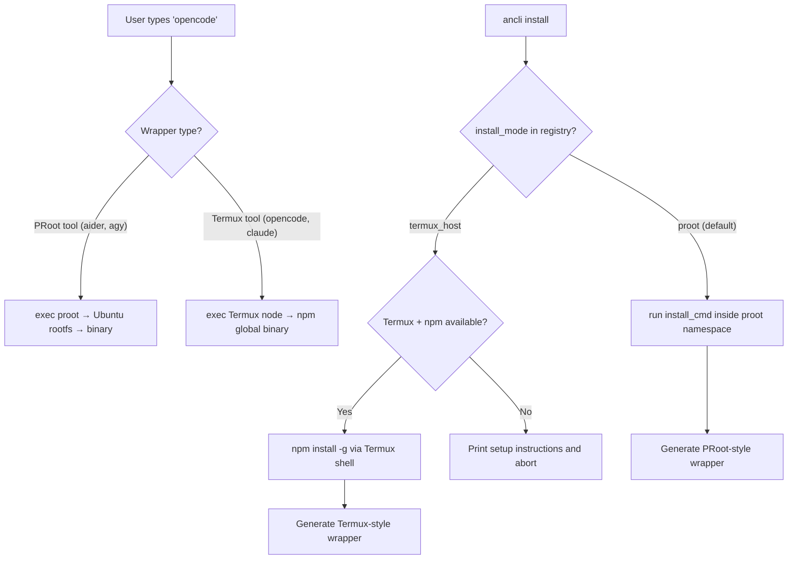

# AnCLI Technical Architecture & Deep Dive

This document outlines the internal design, lifecycle, security model, and execution flows of **AnCLI (Android CLI) v1.2.0**. It is intended for developers, maintainers, and power users who wish to understand the inner workings of this environment manager.

---

## 1. Dual-Mode Execution Architecture

AnCLI uses two distinct execution backends, selected automatically based on the tool's runtime stack.

### 1.1 Why Two Backends?

Android's Linux kernel is paired with Bionic C library instead of the standard GNU glibc. This creates two fundamentally different challenges:

| Challenge | Affected Tools | Solution |
| :--- | :--- | :--- |
| **Bionic incompatibility** | Python, Go binaries built for glibc | PRoot/Ubuntu container providing full glibc |
| **PRoot ptrace thread bug** | Node.js (`npm`), Bun | Bypass PRoot entirely; run natively in Termux |

The PRoot `ptrace` thread bug is a fundamental limitation on Android 15: PRoot intercepts system calls from the **main thread** correctly, but worker threads spawned by Node.js's `libuv` thread pool have their path translations silently corrupted — `mkdir('/root')` inside the container resolves to `/root` on the host (which does not exist), causing `npm install` to fail with `ENOENT` regardless of directory structure.

### 1.2 Backend A: PRoot/Ubuntu Container

```
Host Shell
    → Wrapper (/data/adb/ksu/bin/<tool>)
        → proot v5.3.0 (user-space chroot)
            → Ubuntu 24.04 glibc rootfs (/data/local/tmp/ancli/rootfs/)
                → Python / Go binary
```

**Used for**: `aider`, `mimo`, `agy` and all Python/Go tools.

- `customize.sh` downloads the official `ubuntu-base-arm64` tarball (~30 MB) and extracts it to `/data/local/tmp/ancli/rootfs/`.
- `apt-get` installs `python3`, `python3-pip`, `git`, `nodejs` inside the namespace.
- PRoot bind-mounts `/dev`, `/proc`, `/sys`, `/sdcard`, and `/data/adb` so the container can access hardware, network, and the host filesystem.

### 1.3 Backend B: Termux Host

```
Host Shell
    → Wrapper (/data/adb/ksu/bin/<tool>)
        → Termux nodejs (/data/data/com.termux/files/usr/bin/node)
            → npm global binary (/data/data/com.termux/files/usr/lib/node_modules/...)
```

**Used for**: `claude-code`, `opencode` and all Node.js tools.

- No PRoot involvement. The wrapper directly invokes the Termux-side executable.
- `ancli-core.py` detects Termux at `TERMUX_PREFIX` (`/data/data/com.termux/files/usr`).
- If Termux or `npm` is absent, the user is prompted with clear instructions before installation begins.
- `npm install -g` runs inside a Termux shell subprocess with the correct `PREFIX` environment, placing binaries under Termux's `$PREFIX/bin/`.

### 1.4 Execution Flow Diagram



---

## 2. Module Lifecycle

AnCLI is packaged as a standard **Magisk/KernelSU/APatch systemless module**.

### 2.1 Module ZIP Structure
```
ancli-v1.2.0.zip
├── META-INF/com/google/android/
│   ├── update-binary          # Standard Magisk installer
│   └── updater-script         # #MAGISK marker
├── module.prop                # Metadata + updateJson for OTA
├── customize.sh               # Runs during flash (bootstrap)
├── service.sh                 # Runs after every boot
├── uninstall.sh               # Runs on module removal
├── system/bin/ancli           # Auto-mounted to /system/bin/
└── ancli/
    ├── ancli-core.py          # Bundled package manager
    └── registry.json          # Fallback registry
```

### 2.2 Lifecycle Hooks

| Hook | When | What it does |
| :--- | :--- | :--- |
| **`customize.sh`** | Module is flashed | Downloads PRoot, Ubuntu rootfs, installs APT deps, deploys core script, injects instant-access wrappers |
| **`service.sh`** | Every boot (`late_start`) | Fixes DNS (`resolv.conf`), ensures PRoot and core script have correct permissions |
| **`uninstall.sh`** | Module removed | Kills PRoot processes, removes rootfs, cleans KSU/AP dynamic wrappers |
| **`system/bin/ancli`** | Boot (overlay mount) | Framework auto-mounts this to `/system/bin/ancli` |
| **`updateJson`** | Manager update check | Points to `update.json` on GitHub |

---

## 3. The Cloud Plugin Registry System

### 3.1 JSON Schema

```json
{
  "version": "1.0.0",
  "apps": {
    "aider": {
      "name": "Aider",
      "description": "AI pair programming in your terminal",
      "install_mode": "proot",
      "install_cmd": "pip install aider-chat",
      "update_cmd": "pip install --upgrade aider-chat",
      "uninstall_cmd": "pip uninstall -y aider-chat",
      "env_vars": ["ANTHROPIC_API_KEY"],
      "optional_env_vars": ["OPENAI_API_BASE"],
      "executable": "aider"
    },
    "opencode": {
      "name": "OpenCode",
      "description": "Open-source terminal-based AI coding agent",
      "install_mode": "termux_host",
      "install_cmd": "npm install -g opencode-ai",
      "update_cmd": "npm update -g opencode-ai",
      "uninstall_cmd": "npm uninstall -g opencode-ai",
      "env_vars": ["OPENAI_API_KEY"],
      "optional_env_vars": ["OPENAI_API_BASE"],
      "executable": "opencode"
    }
  }
}
```

**Key field**: `install_mode`
- `"proot"` (default if omitted): installs inside the Ubuntu container via PRoot.
- `"termux_host"`: installs via Termux's `npm`; wrapper calls the Termux binary directly.

### 3.2 Registry Fetch with Retry

The Python core fetches the registry with a 3-attempt retry (15-second timeout, 2-second backoff). Falls back to local cache, then the bundled fallback shipped in the module.

---

## 4. The "Dual-Injection" Systemless Wrapper Trick

### 4.1 PRoot Wrapper (Python/Go tools)

```sh
#!/system/bin/sh
export ANTHROPIC_API_KEY='sk-...'
export PATH=/usr/local/sbin:/usr/local/bin:/usr/sbin:/usr/bin:/sbin:/bin:/root/.local/bin
export HOME=/root
exec /data/local/tmp/ancli/bin/proot \
    -r /data/local/tmp/ancli/rootfs \
    -b /dev -b /proc -b /sys -b /data/local/tmp/ancli -b /sdcard \
    -w /root /usr/bin/env aider "$@"
```

### 4.2 Termux Host Wrapper (Node.js tools)

```sh
#!/system/bin/sh
export OPENAI_API_KEY='sk-...'
export PATH=/data/data/com.termux/files/usr/bin:/data/data/com.termux/files/usr/sbin:$PATH
export LD_LIBRARY_PATH=/data/data/com.termux/files/usr/lib
export TERMUX_PREFIX=/data/data/com.termux/files/usr
exec /data/data/com.termux/files/usr/bin/opencode "$@"
```

### 4.3 Dual-Injection Routing

Both wrapper types are written to **two paths simultaneously**:

1. **`/data/adb/modules/ancli/system/bin/<tool>`** — Systemless mount, active after reboot.
2. **`/data/adb/ksu/bin/<tool>` and `/data/adb/ap/bin/<tool>`** — Dynamic root manager paths, **active immediately without reboot**.

---

## 5. Termux Detection & Setup Flow

When installing a `termux_host` app, `ancli-core.py` performs the following checks:

```
1. Check TERMUX_PREFIX = /data/data/com.termux/files/usr
2. Check $TERMUX_PREFIX/bin/npm exists
   → If not: print "Please install nodejs in Termux: pkg install nodejs" and abort
3. Run: $TERMUX_PREFIX/bin/npm install -g <package>
4. Resolve executable path: $TERMUX_PREFIX/bin/<executable>
5. Generate Termux-style wrapper with correct PATH/LD_LIBRARY_PATH
6. Inject wrapper to dual paths
```

---

## 6. Security Model

| Layer | Mechanism | Protects Against |
| :--- | :--- | :--- |
| **Command Whitelist** | Only `pip`, `npm`, `apt-get`, `curl`, `rm`, `agy` prefixes allowed | Malicious registry entries |
| **Shell Operator Blocking** | Blocks `` ` ``, `$(` in commands | Pipeline injection |
| **Env Var Escaping** | `shlex.quote()` on all user input | Shell injection via API keys |
| **Path Traversal Guard** | Rejects executable names with `/`, `\`, `..` | Arbitrary wrapper writes |
| **Atomic File Writes** | `installed.json` written via temp file + `os.replace()` | Data corruption on power loss |
| **Corruption Recovery** | `load_installed()` catches `JSONDecodeError` | Corrupted state file crashes |

---

## 7. Physical Layout Mapping

**PRoot/Ubuntu tools (from Android host perspective):**
- **Ubuntu Rootfs**: `/data/local/tmp/ancli/rootfs/`
- **Pip Globals** (aider, mimo): `/data/local/tmp/ancli/rootfs/usr/local/lib/python3.x/dist-packages/`
- **AnCLI Core Script**: `/data/local/tmp/ancli/bin/ancli-core.py`
- **Installed Apps Database**: `/data/local/tmp/ancli/installed.json`
- **Registry Cache**: `/data/local/tmp/ancli/registry.json`

**Termux Host tools:**
- **Termux Prefix**: `/data/data/com.termux/files/usr/`
- **NPM Globals** (claude, opencode): `/data/data/com.termux/files/usr/lib/node_modules/`
- **Termux Binaries**: `/data/data/com.termux/files/usr/bin/`

**Module & Wrapper paths:**
- **Magisk/KSU Module Dir**: `/data/adb/modules/ancli/`
- **Systemless Wrappers** (post-reboot): `/data/adb/modules/ancli/system/bin/`
- **Instant Wrappers** (KSU): `/data/adb/ksu/bin/`
- **Instant Wrappers** (APatch): `/data/adb/ap/bin/`

---

## 8. CLI Command Reference

```
ancli                          Interactive App Store menu
ancli install <app_id>         Install an app from the registry
ancli uninstall <app_id>       Uninstall an installed app
ancli update <app_id>          Update an installed app & regenerate wrapper
ancli config <app_id>          Reconfigure env vars & regenerate wrapper
ancli list                     List all installed apps with metadata
ancli --version                Show version (v1.2.0)
ancli --help                   Show help
```

---

## 9. Building from Source

```bash
git clone https://github.com/AHLLX/AnCLI-Android.git
cd AnCLI-Android

# Package the module ZIP
sh build.sh
# → Outputs: ancli-v1.2.0.zip (ready to flash)
```

The build script syncs `ancli-core.py` and `registry.json` from `src/` into `src/module/ancli/`, then zips `src/module/` into a flashable module.
