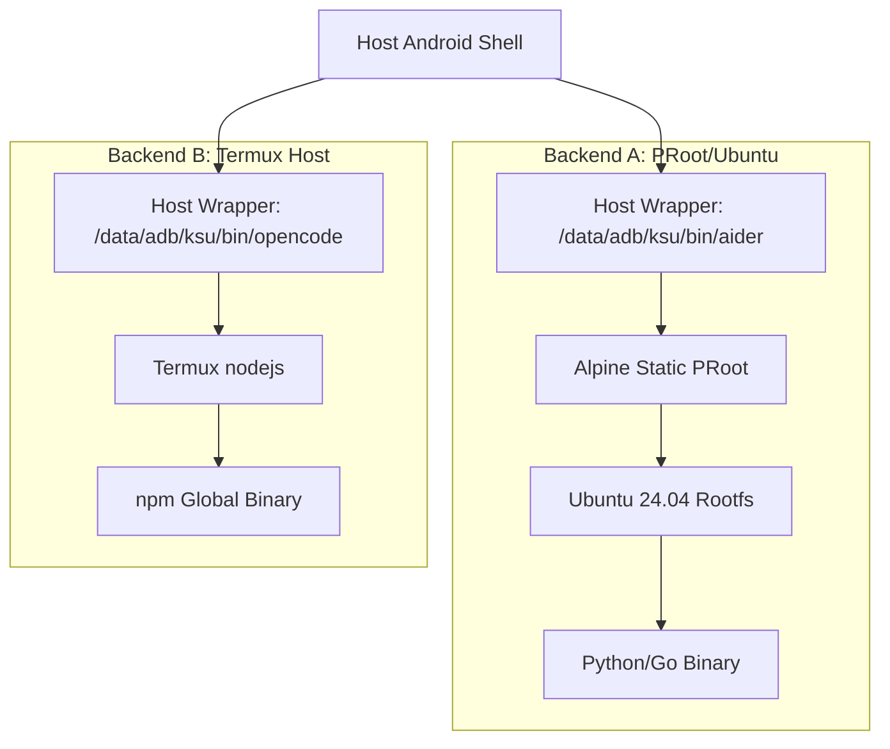

# AnCLI Compatibility & Issue Dossier (v1.2.0)

This document provides a detailed technical record of the execution backends, verification results, and architectural boundaries of **AnCLI** on Android 15.

---

## 1. Environment & Architecture Overview

* **Host OS**: Android 15 (Linux Kernel `6.6.77-android15-8-gca30f3b4bef6`)
* **Environment**: Root shell (`su`) launched from Termux.
* **Backend A (PRoot)**: Ubuntu Base 24.04 (`arm64`) run via PRoot — for Python and Go tools.
* **Backend B (Termux Host)**: Termux native runtime — for Node.js tools.
* **Integration System**: Magisk/KernelSU/APatch systemless module with dynamic wrapper generation.



---

## 2. The Node.js / PRoot Incompatibility (Root Cause Analysis)

### Why npm Cannot Work Inside PRoot on Android 15

PRoot intercepts system calls from the **main thread** via `ptrace` and correctly translates guest paths (e.g., `/root` inside the container) to host paths. However, Node.js uses **libuv**, which spawns a worker thread pool for all asynchronous I/O operations.

**The bug**: Android 15's kernel does not correctly propagate `ptrace` attachment to new threads spawned by a tracee. Worker threads therefore have their system calls processed **without path translation**. A `mkdir('/root')` call from a worker thread resolves to `/root` on the **host** Android filesystem (which does not exist), not inside the container, returning `ENOENT`.

**Experimental proof**:
```javascript
// Worker thread (async) — FAILS under PRoot on Android 15
require('fs').writeFile('/tmp/test.txt', 'hello', (err) => { console.log(err); })
// Returns: null (fake success), but no file is created.

// Main thread (sync) — works correctly
require('fs').writeFileSync('/tmp/test-sync.txt', 'hello')
// File is created successfully.
```

**`npm install` failure trace**:
```
npm verb cache could not create cache: Error: ENOENT: no such file or directory, mkdir '/root'
npm verb logfile could not create logs-dir: Error: ENOENT: no such file or directory, mkdir '/root'
npm verb stack Error: ENOENT: no such file or directory, mkdir '/usr'
npm ERR! code ENOENT
npm ERR! syscall mkdir
npm ERR! path /usr
```

Even `UV_THREADPOOL_SIZE=1` does not fully resolve this because `npm` performs async operations during its own initialization phase, before the event loop starts. The thread pool size variable only controls the libuv worker pool, not all async paths.

### Resolution: Termux Host Backend

The only correct solution is to run `npm` entirely **outside PRoot**, where system calls are handled natively by the Android kernel. AnCLI v1.2.0 introduces the `termux_host` install mode, which:

1. Detects Termux at `/data/data/com.termux/files/usr`.
2. Runs `npm install -g` via Termux's native Node.js runtime.
3. Generates a wrapper that directly executes the Termux-side binary — no PRoot involved.

### Bun Runtime (Claude Code Standalone Binary)

The official pre-compiled Bun standalone binary crashes instantly with a segfault. Bun uses WebKit's **JavaScriptCore (JSC)** engine, which relies on custom page mapping, memory alignment, and Pointer Tagging. PRoot's address-space virtualization violates JSC's memory alignment assumptions.

```
Bun v1.4.0 Linux arm64
panic(main thread): Segmentation fault at address 0xBBADBEEF
```

**Resolution**: `claude-code` is installed via `npm install -g @anthropic-ai/claude-code` through the Termux Host backend. This installs the standard npm package (not the Bun standalone), which runs correctly under Termux's Node.js.

---

## 3. Verification Results

### Backend A: PRoot/Ubuntu

| Tool | Tech Stack | Status | Notes |
| :--- | :--- | :--- | :--- |
| **aider** | Python | ✅ **Supported** | `pip install` on main thread. Fully functional. |
| **mimo** | Python | ✅ **Supported** | `pip install` on main thread. Fully functional. |
| **agy** | Go (static) | ✅ **Supported** | Statically linked. No glibc dependency issues. |

### Backend B: Termux Host

| Tool | Tech Stack | Status | Notes |
| :--- | :--- | :--- | :--- |
| **claude-code** | Node.js (npm pkg) | ✅ **Supported** | Installed via Termux npm. Runs natively. |
| **opencode** | Node.js | ✅ **Supported** | Installed via Termux npm. Runs natively. |

---

## 4. Wrapper Architecture Comparison

### PRoot Wrapper (Python/Go tools)
```sh
#!/system/bin/sh
export ANTHROPIC_API_KEY='sk-...'
export PATH=/usr/local/sbin:/usr/local/bin:/usr/sbin:/usr/bin:/sbin:/bin
export HOME=/root
exec /data/local/tmp/ancli/bin/proot \
    -r /data/local/tmp/ancli/rootfs \
    -b /dev -b /proc -b /sys -b /data/local/tmp/ancli -b /sdcard \
    -w /root /usr/bin/env aider "$@"
```

### Termux Host Wrapper (Node.js tools)
```sh
#!/system/bin/sh
export OPENAI_API_KEY='sk-...'
export PATH=/data/data/com.termux/files/usr/bin:/system/bin
export LD_LIBRARY_PATH=/data/data/com.termux/files/usr/lib
export TERMUX_PREFIX=/data/data/com.termux/files/usr
exec /data/data/com.termux/files/usr/bin/opencode "$@"
```

---

## 5. Requirements & Prerequisites

| Requirement | PRoot Tools | Termux Host Tools |
| :--- | :--- | :--- |
| **Root access** | Required | Required |
| **AnCLI module** | Required | Required |
| **Termux installed** | Not needed | **Required** |
| **`pkg install nodejs`** | Not needed | **Required** |
| **Network on first install** | Required (Ubuntu tarball) | Required (npm registry) |

---

## 6. Summary & Recommendations

1. **PRoot for Python/Go**: Keep using PRoot for tools like `aider`, `mimo`, and `agy`. The container is stable on Android 15.

2. **Termux Host for Node.js**: All npm-based tools must use the `termux_host` install mode. This is the only reliable way to run Node.js tooling on Android 15 with root.

3. **Adding New Tools to the Registry**: Set `"install_mode": "proot"` for Python/Go tools, and `"install_mode": "termux_host"` for npm-based tools. See the registry schema in [ARCHITECTURE.md](ARCHITECTURE.md).
